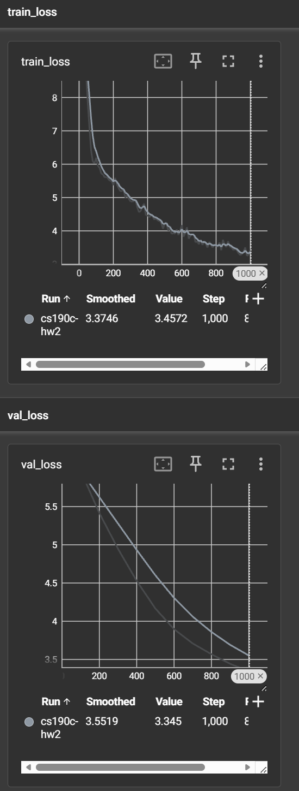
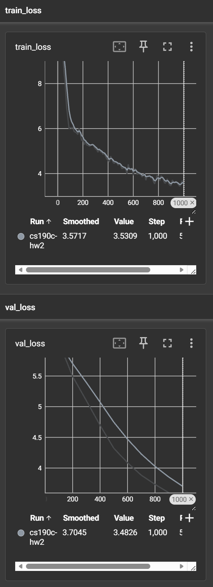
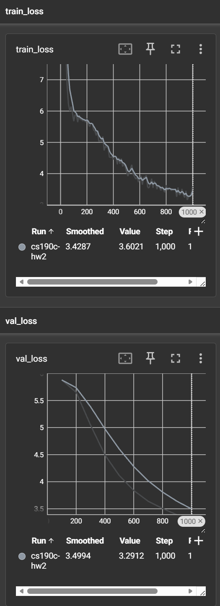
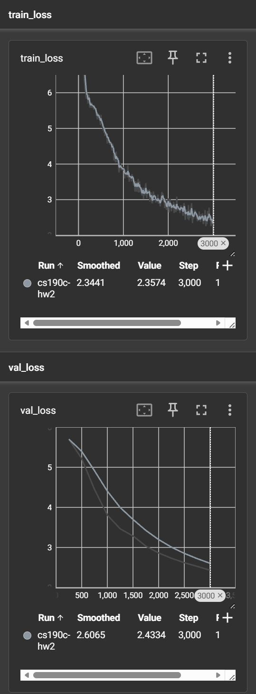

# CS190C Assignment 2 Report

## 1. Experimental Setup

This assignment studies how small single-GPU pilot runs can guide a larger multi-GPU training decision. I trained LLaMA-style decoder-only language models from scratch on the official `roneneldan/TinyStories` training split and used the official validation split for model selection and final reporting. The tokenizer was `roneneldan/TinyStories-33M`, with vocabulary size 50,257 and EOS reused as the padding token.

All required runs used sequence length 512, AdamW, cosine learning-rate decay with warmup, weight decay 0.1, and seed 42. I used Hugging Face `transformers` for `LlamaForCausalLM` and used `accelerate` directly for single-GPU and two-GPU training. TensorBoard logging and checkpointing were enabled in the training loop.

### 1.1 System and Software Setup

The experiments were run on a `H20` cluster node through Hugging Face `accelerate`. Single-GPU pilot experiments used `accelerate_configs/single_gpu.yaml`, which sets `distributed_type: "NO"`, `num_processes: 1`, and `mixed_precision: bf16`. The final scale-up experiment used `accelerate_configs/two_gpu_ddp.yaml`, which sets `distributed_type: MULTI_GPU`, `num_processes: 2`, and `mixed_precision: bf16`.

The software stack included PyTorch, Hugging Face `transformers`, `accelerate`, `datasets`, TensorBoard, PyYAML, tqdm, safetensors, pandas, and matplotlib. The dataset was loaded through the Hugging Face `datasets` cache, and checkpoints were saved with `accelerator.save_state(...)`, including model weights, optimizer state, scheduler state, and random states.

The pilot effective batch size was:

| Stage | GPUs | Per-device batch | Gradient accumulation | Effective batch | Tokens / step |
| --- | ---: | ---: | ---: | ---: | ---: |
| Pilot | 1 | 8 | 4 | 32 sequences | 16,384 |
| Scale-up | 2 | 8 | 8 | 128 sequences | 65,536 |

## 2. Pilot Experiments

I ran six single-GPU pilot experiments. The first three form a learning-rate sweep on model S. After selecting the best learning rate from that sweep, I ran a model-size sweep over XS, S, and M.

### 2.1 Learning-Rate Sweep on Model S

| Run | Model | Learning rate | Steps | Tokens seen | Final validation loss | Final perplexity |
| --- | --- | ---: | ---: | ---: | ---: | ---: |
| `pilot_s_lr2e4` | S | 0.0002 | 1000 | 16,384,000 | 3.5246 | 33.9412 |
| `pilot_s_lr5e4` | S | 0.0005 | 1000 | 16,384,000 | 3.3941 | 29.7870 |
| `pilot_s_lr1e3` | S | 0.0010 | 1000 | 16,384,000 | 3.3450 | 28.3618 |

The learning-rate sweep showed that 0.001 gave the best validation loss among the three tested values. The lower learning rates were stable but learned more slowly within the fixed 1000-step budget. Based on this result, I used 0.001 for the size sweep.

+ **TensorBoard curve for the best S learning-rate pilot run:**



### 2.2 Model-Size Sweep at the Best Learning Rate (lr = 1e-3)

| Run | Model config | Learning rate | Steps | Tokens seen | Final validation loss | Final perplexity |
| --- | --- | ---: | ---: | ---: | ---: | ---: |
| `pilot_xs_bestlr` | XS | 0.0010 | 1000 | 16,384,000 | 3.4826 | 32.5450 |
| `pilot_s_bestlr` | S | 0.0010 | 1000 | 16,384,000 |                3.3450 |          28.3618 |
| `pilot_m_bestlr` | M | 0.0010 | 1000 | 16,384,000 | 3.2912 | 26.8747 |

The size sweep showed a clear trend: larger models achieved lower validation loss under the same token budget and optimizer settings. XS was the weakest, S improved over XS, and M achieved the best validation loss. This suggested that the training setup was not yet saturated by model capacity and that scaling to M was a reasonable final choice.

The extra `pilot_s_bestlr` run reached a similar validation-loss range as the earlier `pilot_s_lr1e3` run, though it did not exactly reproduce the earlier best value. This is reasonable for short 1000-step pilot runs, where data order, initialization, and GPU nondeterminism can create visible run-to-run variation. The main conclusion remains unchanged because model M achieved the best validation loss in the size sweep.

+ **TensorBoard curve for the XS model-size pilot run:**



+ **TensorBoard curve for the M model-size pilot run:**



## 3. Scale-Up Decision

For the final two-GPU run, I selected model M with learning rate 0.001. This choice was based on two observations from the pilot study:

1. The learning-rate sweep showed that 0.001 was the best tested learning rate for model S.
2. The model-size sweep showed that M outperformed XS and S under the same pilot token budget.

Compared with the pilot M run, the final run increased three required dimensions:

| Quantity | Pilot M | Final M scale-up |
| --- | ---: | ---: |
| GPUs | 1 | 2 |
| Effective batch size | 32 sequences | 128 sequences |
| Training tokens | 16,384,000 | 196,608,000 |
| Training steps | 1000 | 3000 |

This satisfies the assignment requirement to increase at least two of GPU count, model size, total tokens, and effective batch size. I kept the model family, tokenizer, sequence length, optimizer, and learning-rate schedule fixed so that the scale-up comparison remained controlled.

## 4. Final Validation Results

| Run | Model | Accelerate config | GPUs | Effective batch | Tokens seen | Final validation loss | Final perplexity |
| --- | --- | --- | ---: | ---: | ---: | ---: | ---: |
| `scaleup_m` | M | `two_gpu_ddp.yaml` | 2 | 128 sequences | 196,608,000 | 2.4334 | 11.3970 |

The final run substantially improved over the pilot M run, reducing validation loss from 3.2912 to 2.4334 and perplexity from 26.8747 to 11.3970. This behavior matched the expectation from the pilot results: model M was the strongest pilot model, and giving it more training tokens and a larger effective batch on two GPUs improved validation performance.

+ **TensorBoard curve for the final two-GPU scale-up run:**



The TensorBoard logs for Part C are saved under:

```text
outputs/scaleup_m/cs190c-hw2/
```

The exported TensorBoard figures are saved in:

```text
plots/
```

Relevant figures include `plots/scaleup_m.png` for the final run and `plots/pilot_xs_bestlr.png` and `plots/pilot_m_bestlr.png` for the size sweep.

## 5. Discussion

The pilot experiments were useful for making the final training decision. The learning-rate sweep reduced uncertainty about the optimizer setting, and the size sweep showed that larger models still benefited from the fixed pilot token budget. Because M was the best pilot model, it was the natural candidate for the two-GPU run.

The scale-up behaved as expected. Increasing total tokens from 16.4M to 196.6M produced a much lower validation loss, and using two GPUs allowed a larger effective batch size while keeping the run practical. The final result is not just a lower loss; it is also supported by a controlled sequence of smaller experiments.

I did not attempt the optional FSDP or DeepSpeed bonus experiments. The final distributed run used standard two-GPU DDP through `accelerate`.

## 6. Submitted Artifacts

The submission includes:

- Completed training and evaluation code in `scripts/train.py` and `scripts/evaluate.py`.
- Pilot results table in `results/pilot_results.csv`.
- Final scale-up results in `results/scaleup_results.csv`.
- Part C TensorBoard logs in `outputs/scaleup_m/cs190c-hw2/`.
- Exported TensorBoard figures in `plots/`.
